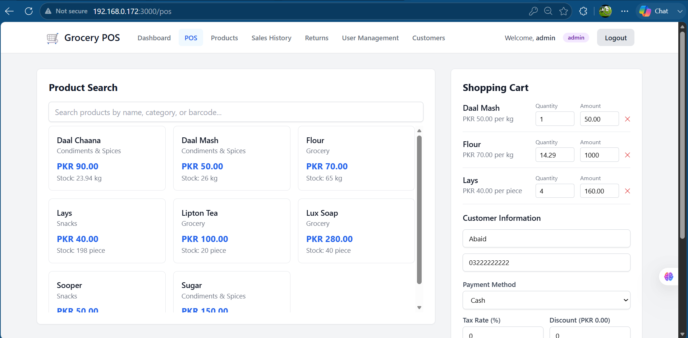
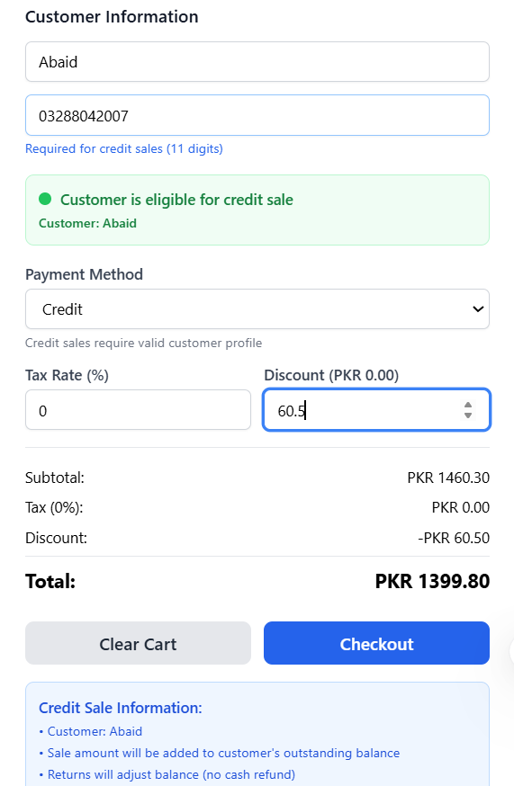
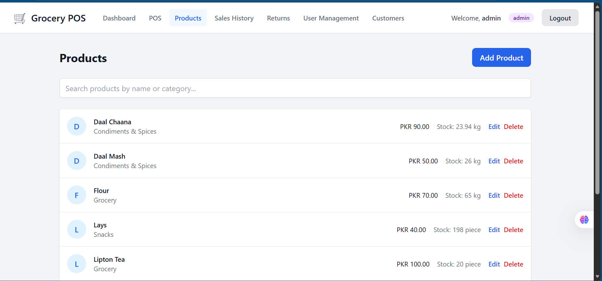
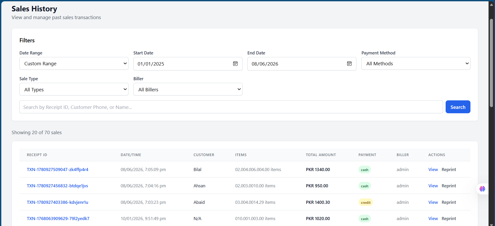
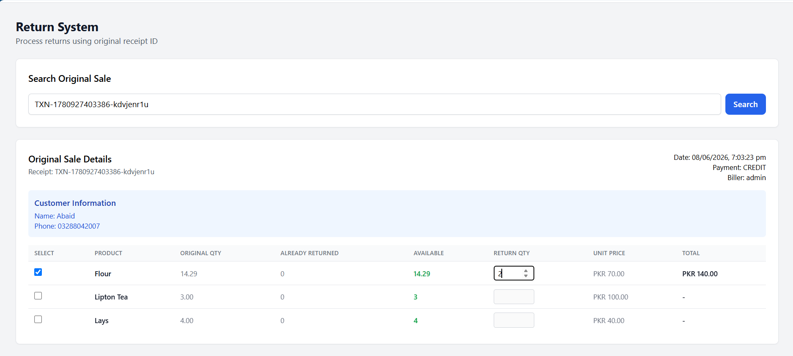
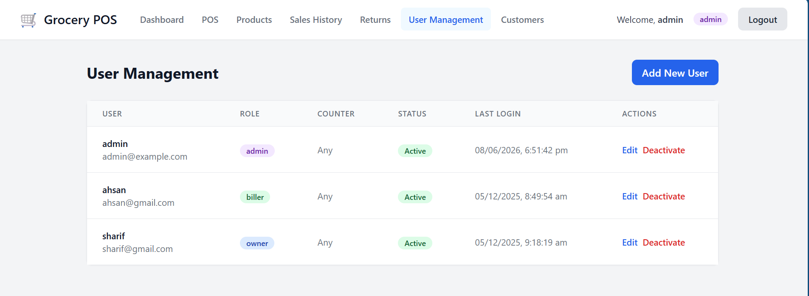
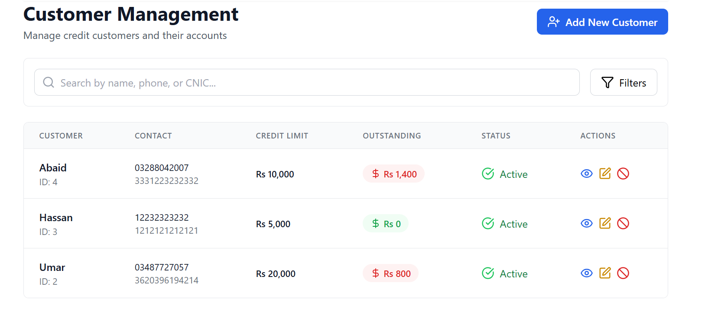
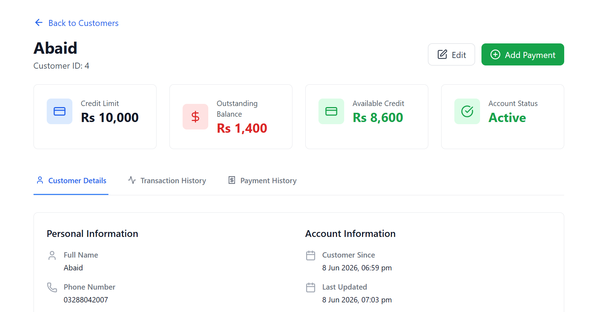

# Grocery POS & Retail Management System

A full-stack, production-ready Point of Sale and retail management system 
designed for small to medium grocery stores. Built with a multi-counter 
LAN-based architecture enabling multiple billing terminals to operate 
simultaneously on a single local network.



---

## The Problem

Small grocery stores in Pakistan rely on manual billing, paper ledgers for 
credit customers, and have no real-time visibility into stock levels across 
multiple counters. This system digitalizes the entire retail operation — 
from billing to credit management to returns — in an offline-first 
environment that works without internet dependency.

---

## Key Features

- **Multi-counter billing** — multiple terminals sync in real-time via Socket.io
- **Role-based access control** — Admin, Owner, and Biller roles with different permissions
- **Customer credit system** — credit limits, outstanding balance tracking, payment history
- **Complete sales lifecycle** — billing, returns, partial refunds, receipt reprinting
- **Real-time inventory** — automatic stock deduction on sale, restoration on returns
- **Audit logging** — every critical action logged with before/after values
- **Offline-first** — runs entirely on local LAN, no internet required

---

## Screenshots

### POS Billing — Product Search & Shopping Cart


### Credit Sale — Eligibility Verification


### Product Management — Inventory & Stock Levels


### Sales History — Advanced Filters & Search


### Return System — Partial Returns Against Receipt


### User Management — Role-Based Access Control


### Customer Management — Credit Limits & Outstanding Balances


### Customer Profile — Credit Details & Transaction History


---

## Tech Stack

| Layer | Technology |
|---|---|
| Frontend | React 18, TypeScript, Vite, Tailwind CSS |
| State Management | Redux Toolkit |
| Backend | Node.js, Express, TypeScript |
| Database | PostgreSQL, Sequelize ORM |
| Real-time Sync | Socket.io |
| Authentication | JWT |
| Routing | React Router |
| HTTP Client | Axios |

---

## System Architecture

**Local Server-Based Distributed System:**
- Owner/Admin PC acts as central server
- Multiple billing counters connect via LAN
- Offline-first design — works entirely within shop network
- Socket.io handles real-time sync across all terminals

**When one counter processes a sale:**
```text
Counter A processes sale
        ↓
Backend updates PostgreSQL
        ↓
Socket.io broadcasts to all counters
        ↓
Counter B, C instantly see updated stock
```

---

## Modules

**POS System**
Product search by name, category, or barcode. Cart management with 
automatic price calculation. Cash, card, and credit payment methods. 
Tax and discount support. Real-time stock deduction on checkout.

**Customer Credit System**
Customer profiles with credit limits. Outstanding balance tracking. 
Credit eligibility validation on checkout. Payment recording with 
partial payment support. Combined transaction and payment history per customer.

**Returns System**
Process returns using original receipt ID. Partial returns supported. 
Multiple returns per sale allowed. Automatic stock restoration. 
Credit balance adjustment on credit sale returns.

**User Management**
Three roles with different access levels:
- Admin — full system control
- Owner — business-level access
- Biller — POS operations only

**Sales History**
Filter by date range, payment method, sale type, and biller. 
Search by receipt ID, customer phone, or name. Receipt viewing and reprinting.

**Audit Logging**
All critical actions logged with user, action type, timestamp, 
and before/after values for data integrity.

---

## Current Status

 **Active Development**

Core system complete and functional:
-  POS billing engine
-  Multi-counter real-time sync
-  Customer credit system
-  Returns processing
-  User management & RBAC
-  Sales history & filtering
-  Audit logging

In progress:
-  Analytics dashboard
-  Reports & exports

---

## Note

This system is being developed for real retail deployment. 
Source code is available upon request for academic or professional review.
